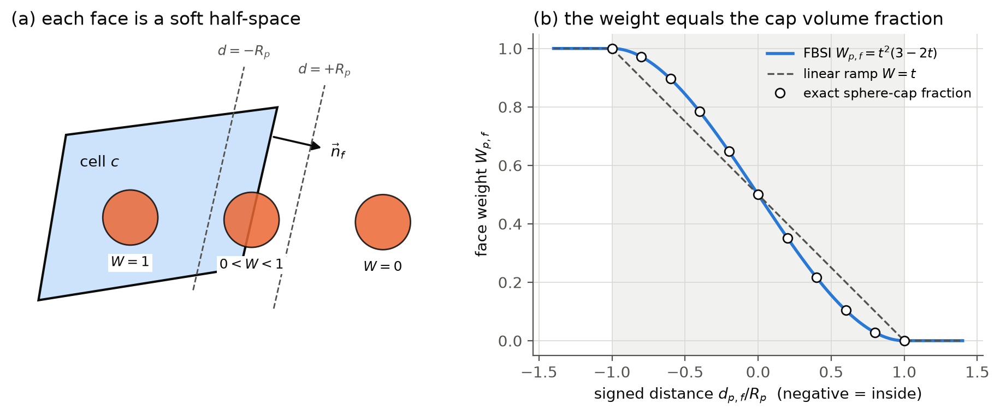
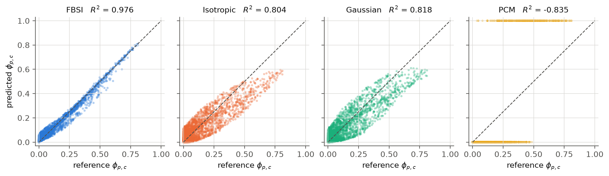
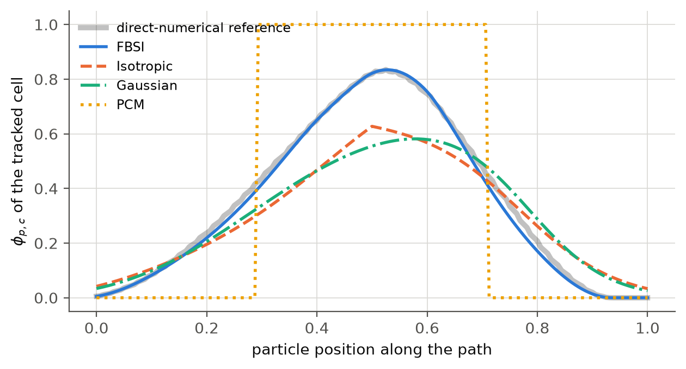

# FBSI: Face-Based Soft-Intersection

**Accurate, smooth, tuning-free particle-to-cell volume mapping for Lagrangian–Eulerian (CFD–DEM) coupling on any mesh.**

[](https://doi.org/10.1016/j.cma.2026.119161)
[](https://doi.org/10.5281/zenodo.XXXXXXX)
[](https://github.com/alirezakianim/fbsi-volume-fraction/actions/workflows/tests.yml)
[](LICENSE)

This repository is the reference implementation of a method published in a peer-reviewed journal:

> [!IMPORTANT]
> **Published paper:** A. Kianimoqadam, A. J. Schrader, *An anisotropic, Face-Based Soft-Intersection
> method for robust Lagrangian–Eulerian coupling*, **Computer Methods in Applied Mechanics and
> Engineering 461 (2026) 119161**. [https://doi.org/10.1016/j.cma.2026.119161](https://doi.org/10.1016/j.cma.2026.119161)
>
> **If you use FBSI or this code in your work, please cite this paper.** See [How to cite](#how-to-cite).

It is meant for **learning and adopting** the method. It contains short, readable implementations in
**Python** and **C++**, tests, runnable examples, and a guide for adding FBSI to your own solver.



---

## Why FBSI?

In CFD–DEM and other Lagrangian–Eulerian simulations, each particle's volume has to be shared among
the fluid cells it overlaps. The resulting solid (void) fraction drives the fluid–particle coupling,
so errors in it go straight into the drag forces and the stability of the simulation.

* **Point-centroid (PCM)** mapping puts the whole particle in one cell. It is cheap, but the volume
  fraction jumps as particles cross faces.
* **Isotropic kernels** (Gaussian, polynomial, GIM) smooth the volume using only the distance to cell
  centroids, so they treat every cell as a sphere. That fails on stretched boundary-layer cells,
  skewed cells and unstructured meshes, and the smoothing length has to be tuned.
* **FBSI** represents each cell as the intersection of *soft half-spaces* built from its **faces**.
  The weight follows the true cell shape, has **no tuning parameter**, conserves volume exactly, and
  costs about the same as an isotropic kernel.

## The method in five lines

For a particle with centre $\vec x_p$ and radius $R_p$, and a cell $c$ with faces $f$ (outward unit
normal $\vec n_f$, face centroid $\vec x_f$):

```math
\begin{aligned}
d_{p,f} &= \vec n_f \cdot (\vec x_p - \vec x_f) && \text{signed distance to face } f\\
t_{p,f} &= \frac{1}{2}\left[\mathrm{clamp}(-d_{p,f}/R_p,\,-1,\,1) + 1\right] && \text{position inside the band } \pm R_p\\
W_{p,f} &= t_{p,f}^2\,(3 - 2t_{p,f}) && \text{soft half-space (smoothstep)}\\
S_{p,c} &= \prod_f W_{p,f} && \text{anisotropic shape factor}\\
\phi_{p,c} &= S_{p,c} \,/\, \sum_k S_{p,k} && \text{fraction of the particle in cell } c
\end{aligned}
```

The smoothstep $W_{p,f}$ is exactly the volume fraction of a sphere cut by a plane, so FBSI is exact
whenever a particle crosses a single face. See **[docs/method.md](docs/method.md)** for the full explanation.

## Results

Published results ([paper](https://doi.org/10.1016/j.cma.2026.119161), $10^6$ particles per mesh,
against a direct-numerical reference):

| | FBSI | Best isotropic kernel |
|---|---|---|
| Tetrahedral mesh, $R^2$ | **0.981** | ≈ 0.88 |
| Tetrahedral mesh, mean absolute error | **1.4 × 10⁻²** | 3.2 × 10⁻² |
| Hexahedral mesh stretched 1:1:2, $R^2$ | **→ 1.00** | 0.91 |
| Cost relative to PCM | 3.7–4.3× | 3.7–4.4× (polynomial), 4.8–5.7× (Gaussian) |
| Tuning parameters | **none** | smoothing length |

The same comparison, reproduced at small scale with the code in this repository (400 particles on a
6000-cell tetrahedral mesh, `python docs/make_figures.py`):



A single particle moving through a tetrahedral mesh: FBSI follows the reference smoothly, PCM jumps,
and the isotropic kernels spread the volume too widely:

<p align="center"></p>

## Repository layout

```text
fbsi-volume-fraction/
├── python/
│   ├── fbsi/                  Python package (numpy only)
│   │   ├── core.py            ← the method: face_weights, shape_factor, fbsi_fractions
│   │   ├── cell.py            convex cells from faces/vertices; virtual exterior cells
│   │   ├── reference.py       direct-numerical (voxel) reference, for validation
│   │   ├── baselines.py       PCM, isotropic and Gaussian kernels, for comparison
│   │   └── meshes.py          small hexahedral/tetrahedral test meshes
│   ├── examples/              01_quickstart … 04_wall_boundary
│   └── tests/                 pytest suite
├── cpp/
│   ├── include/fbsi/fbsi.hpp  header-only C++17 library (copy it into your solver)
│   ├── examples/              quickstart, mesh_benchmark
│   └── tests/                 dependency-free test program (run with ctest)
├── docs/
│   ├── method.md              the method, step by step
│   ├── implementation_guide.md  how to add FBSI to your solver
│   └── make_figures.py        regenerates the figures above
├── CITATION.cff               citation metadata ("Cite this repository" on GitHub)
└── LICENSE                    MIT
```

## Quick start: Python

Requires Python ≥ 3.9 and numpy (matplotlib is optional, for plots).

```bash
git clone https://github.com/alirezakianim/fbsi-volume-fraction.git
cd fbsi-volume-fraction
pip install -e "python[examples,test]"

python python/examples/01_quickstart.py              # the method on tiny examples
python python/examples/02_mesh_benchmark.py --mesh tet   # FBSI vs PCM / kernels vs reference
python python/examples/03_particle_translation.py --plot # smoothness test
python python/examples/04_wall_boundary.py           # particles touching a wall
pytest python/tests                                  # run the tests
```

Minimal use:

```python
from fbsi import Cell, fbsi_fractions

left  = Cell.box([0, 0, 0], [1, 1, 1])
right = Cell.box([1, 0, 0], [2, 1, 1])

phi = fbsi_fractions(center=[0.9, 0.5, 0.5], radius=0.3, cells=[left, right])
print(phi)   # [0.7407 0.2593]  (exact spherical-cap split)
```

Any convex cell can be built from mesh connectivity with
`Cell.from_polyhedron(vertices, faces)`, or directly from face normals and centroids with
`Cell(normals, points)`.

## Quick start: C++

Requires a C++17 compiler and CMake ≥ 3.14 (CMake is only needed for the examples and tests).

```bash
cmake -S cpp -B build
cmake --build build
./build/quickstart
./build/mesh_benchmark tet 1000 0.8   # accuracy and cost of FBSI vs PCM
ctest --test-dir build                # run the tests
```

Minimal use (just `#include` the header):

```cpp
#include <fbsi/fbsi.hpp>

fbsi::Cell left  = fbsi::make_box({0, 0, 0}, {1, 1, 1});
fbsi::Cell right = fbsi::make_box({1, 0, 0}, {2, 1, 1});

std::vector<double> phi;
fbsi::fbsi_fractions({0.9, 0.5, 0.5}, 0.3, {&left, &right}, phi);   // phi = {0.7407, 0.2593}
```

## Using FBSI in your solver

You need, for each cell, the outward unit normal and centroid of each face (standard finite-volume data),
and for each particle, its host cell and neighbours. The
**[implementation guide](docs/implementation_guide.md)** covers:

* where FBSI sits in the CFD–DEM coupling loop,
* how to choose candidate cells,
* face orientation in OpenFOAM, Fluent and generic solvers,
* walls, inlets and outlets (virtual exterior cells),
* performance and parallelisation,
* a checklist of test cases for your own implementation.

## How to cite

FBSI is published in *Computer Methods in Applied Mechanics and Engineering*. **If you use the method
or this code in your work, whether you use it as-is, adapt it, or reimplement it in your own solver,
please cite the paper.**

### 1. Cite the paper

**Reference**

> A. Kianimoqadam, A. J. Schrader, An anisotropic, Face-Based Soft-Intersection method for robust
> Lagrangian–Eulerian coupling, *Computer Methods in Applied Mechanics and Engineering* 461 (2026) 119161.
> https://doi.org/10.1016/j.cma.2026.119161

**BibTeX** (LaTeX users: copy this into your `.bib` file and cite it with `\cite{Kianimoqadam2026FBSI}`)

```bibtex
@article{Kianimoqadam2026FBSI,
  author  = {Kianimoqadam, Alireza and Schrader, Andrew J.},
  title   = {An anisotropic, Face-Based Soft-Intersection method for robust
             {Lagrangian--Eulerian} coupling},
  journal = {Computer Methods in Applied Mechanics and Engineering},
  volume  = {461},
  pages   = {119161},
  year    = {2026},
  doi     = {10.1016/j.cma.2026.119161}
}
```

**Other formats** (APA, RIS for EndNote, Zotero or Mendeley):

* On this GitHub page, click **"Cite this repository"** in the right-hand sidebar. It gives the paper
  citation in APA and BibTeX format.
* In Zotero use *Add Item by Identifier*, or in Mendeley use *Add by DOI*, and paste the DOI
  `10.1016/j.cma.2026.119161`.
* The [publisher's page](https://doi.org/10.1016/j.cma.2026.119161) also exports the citation.

**Example sentence** for the methods section of your paper:

> The particle volume was mapped to the fluid cells with the Face-Based Soft-Intersection (FBSI)
> method [ref].

### 2. Also cite the software (optional)

If you used this code in particular, you can **additionally** cite the archived software release
(Zenodo DOI). This is in addition to the paper, not instead of it:

```bibtex
@software{Kianimoqadam_FBSI_software,
  author    = {Kianimoqadam, Alireza and Schrader, Andrew J.},
  title     = {{FBSI}: Face-Based Soft-Intersection particle-to-cell volume mapping},
  publisher = {Zenodo},
  version   = {1.0.0},
  year      = {2026},
  doi       = {10.5281/zenodo.XXXXXXX},
  url       = {https://doi.org/10.5281/zenodo.XXXXXXX}
}
```

### Related work

The Gaussian Integral Method (GIM), one of the isotropic kernels FBSI is compared against:
A. Kianimoqadam, J. Lapp, *Gaussian integral method for void fraction*, Particuology 108 (2026) 125–142.
[doi:10.1016/j.partic.2025.10.014](https://doi.org/10.1016/j.partic.2025.10.014)

## Contributing

Questions, bug reports and implementations in other solvers are welcome. Please open an
[issue](../../issues) or see [CONTRIBUTING.md](CONTRIBUTING.md).

## License

Released under the [MIT License](LICENSE).

## Acknowledgments

This material is based upon work supported by the U.S. Department of Energy's Office of Energy
Efficiency and Renewable Energy (EERE) under the Solar Energy Technology Office (SETO) Award Number
DE-LC-00L108 led by Sandia National Laboratories. The views expressed here do not necessarily represent
the views of the U.S. Department of Energy or the United States Government.

## Authors

- **Alireza Kianimoqadam**, Department of Mechanical and Aerospace Engineering, University of Dayton,
  [ORCID 0000-0003-0000-8080](https://orcid.org/0000-0003-0000-8080)
- **Andrew J. Schrader**, Department of Mechanical and Aerospace Engineering, University of Dayton
